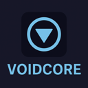
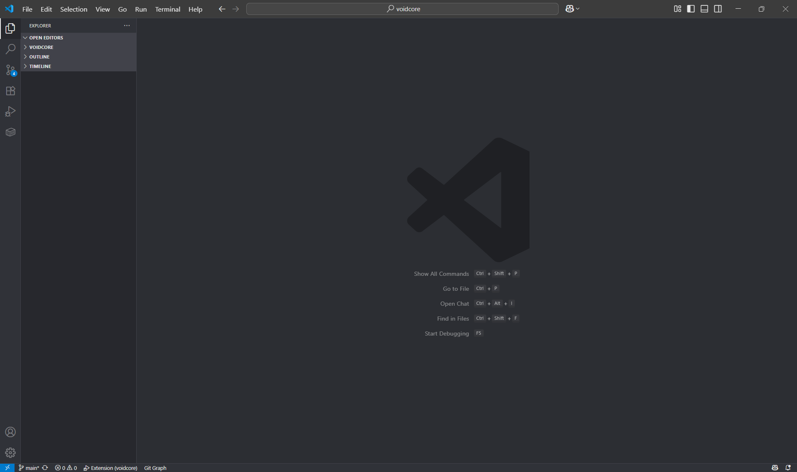
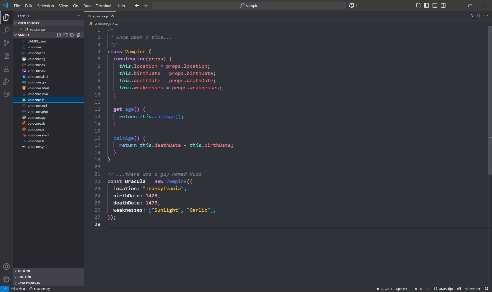
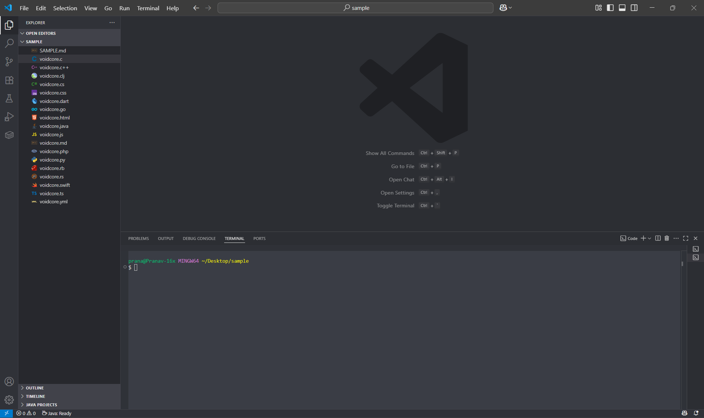

# VoidCore A Sleek, and Minimal VS Code Theme

   
    

> 
Theme your eyes will love.

 

**VoidCore** is a sleek, minimal, and high-contrast dark theme for Visual Studio Code, built for developers who code like they’re inside a simulation. Tailored for deep-focus, late-night creativity, and zero-distraction workflows.

## Images :

---

## ✨ Features

- 🧠 **Designed for focus** – No distractions, just clean colors and clean code.
- 🌌 **Dark theme optimized** – Deep backgrounds, luminous syntax, developer-core aesthetics.
- 💻 **Productivity-tuned** – Readable, non-fatiguing palette for long coding sessions.
- 🧪 **Extensive syntax coverage**:
  - JavaScript / TypeScript
  - HTML / CSS / SCSS
  - Python, C/C++, Rust
  - Markdown, YAML, JSON
  - Bash, Dockerfiles, Git config
- 🔧 **UI Consistency** – Sidebars, tabs, activity bar, and popups all match the tone of VoidCore

> 💡 VoidCore requires Visual Studio Code version **1.80.0 or newer** (June 2023) to work as intended.

---

## 🚀 Installation

### ▶️ From VS Code Marketplace

1. Open **Extensions** sidebar in VS Code (`Ctrl+Shift+X`)
2. Search for `VoidCore`
3. Click **Install**
4. Hit `Ctrl+K Ctrl+T` to pick the theme

## Author: 
[Pranav Verma](https://github.com/pranav89624)

## License
This theme is released under the [MIT License](https://github.com/pranav89624/VoidCore/blob/main/LICENSE.MD)

  copyright © 2025 Pranav Verma

